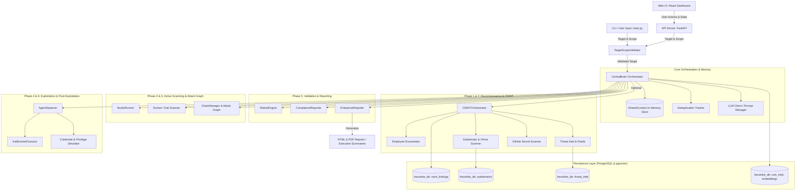

# AntiGravity System Architecture

This document provides a detailed technical overview of the **AntiGravity Autonomous Penetration Testing Platform (v2.0)**, detailing its architectural design, state management, tool integration layer, execution pipelines, and security controls.

---

## 1. High-Level Architecture Diagram



---

## 2. Component Breakdown

### 2.1 CentralBrain (`core/central_brain.py`) & Core Engines (V2)
`CentralBrain` is the core autonomous engine. It operates as an asynchronous state machine driven by LLM prompts, while utilizing V2 Core Engines for deterministic validation:
- **`ExecutionPipelineV2`**: Provides robust, repeatable fallback mechanisms using specialized executors (e.g., `SQLiExecutor`, `XSSExecutor`).
- **`CoverageMatrix` & `EndpointInventoryV2`**: Ensures 100% test coverage by tracking endpoints against the test catalog.

- **Phases Managed**:
  1. `RECON`: Network discovery, DNS resolution, port scanning, web crawling.
  2. `OSINT_RECONNAISSANCE` *(Optional, controlled via `ENABLE_OSINT`)*: Passive OSINT, employee enumeration, leak detection.
  3. `DEEP_RECONNAISSANCE`: Extended tech-stack profiling and live HTTP request interception.
  4. `ACTIVE_SCANNING`: Vulnerability scanning with technology-matched Nuclei templates, Nmap, SQLMap, ZAP.
  5. `EXPLOITATION`: Attack chain execution, PoC verification (Tier: `POC`, `SHALLOW`, `DEEP`).
  6. `POST_EXPLOITATION`: PrivEsc auditing, credential harvesting simulation, MITRE ATT&CK mapping.
  7. `REPORTING`: Result validation, retesting, compliance mapping, and HTML/PDF report synthesis.

### 2.2 SharedContext (`core/shared_context.py`)
`SharedContext` is the centralized, thread-safe in-memory data store for the entire system:
- **Thread Safety**: Uses Python `threading.Lock` to prevent race conditions when multiple worker agents write simultaneously.
- **State Properties**:
  - `subdomains`, `ips`, `ports`, `technologies`, `endpoints`, `directories`, `headers`, `secrets`, `captured_requests`.
  - `vulnerabilities`, `attack_chains`, `exploit_results`, `harvested_creds`, `mitre_mappings`.
- **Dynamic Accessors**: `update(key, value)` and `get(key, default)` provide clean, key-value access across modules.

### 2.3 OSINT Subsystem (`core/osint_engine.py`, `core/subdomain_enum.py`, `core/threat_intel.py`)
- **OSINT Engine**: Discovers employee emails via web scraping and pattern inference; scans public GitHub repositories for leaked credentials and API keys.
- **Subdomain Enumerator**: Queries Certificate Transparency (crt.sh) logs, performs passive DNS lookups, checks CDN origins, enumerates public cloud buckets (AWS S3, GCP, Azure), and detects virtual hosts.
- **Threat Intelligence Engine**: Integrates with threat feeds (AbuseIPDB, Shodan, Censys, VirusTotal, abuse.ch) to score asset reputation and flag C2 indicators.

### 2.4 Tool Execution Layer (`tools/`, `agents/kali_executor.py`)
- **`ToolRegistry`**: Manages tool registration, input validation, and execution routing.
- **`KaliDockerExecutor`**: Interacts with the `kalilinux/kali-rolling` Docker container (`Dockerfile`). 
- **10-Layer Docker Architecture**: The Kali Dockerfile is deeply optimized using a 10-layer BuildKit cache strategy. It separates System Base, Build Deps, Meta-Packages, Individual Tools, Python Env, Playwright, Go Tools, Workspace, Nuclei templates, and final Verification. This ensures rapid incremental builds and isolated tool failure debugging.
- **Fallback Execution**: If Docker is unavailable, falls back to local tools or mock emulators without crashing the pipeline.

### 2.5 Reporting & Compliance Engine (`core/reporting.py`, `compliance/`)
- **`EnterpriseReporter`**: Synthesizes all gathered data into an executive-ready HTML dashboard and PDF.
- **Compliance Mappers**:
  - `PCI-DSS v4.0`
  - `SOC2 Trust Services Criteria`
  - `HIPAA Security Rule`
  - `CIS Critical Security Controls v8`
  - `NIST Cybersecurity Framework`

---

## 3. Data Flow & Persistence Architecture

1. **Input & Scope Check**: `main.py` passes target input to `TargetScopeValidator`. Out-of-scope requests are immediately blocked.
2. **Context Population**: Agents execute tasks and push structured results to `SharedContext`.
3. **Database Sync (PostgreSQL)**:
   - `OSINTDatabase` -> `osint_findings` table
   - `SubdomainDatabase` -> `subdomains` table
   - `ThreatIntelDatabase` -> `threat_intel` table
   - `PersistentKnowledgeStore` -> `vuln_intel` and `embeddings` (pgvector) tables
4. **Report Construction**: `EnterpriseReporter` reads from `SharedContext` and PostgreSQL databases to produce consolidated reports in the `reports/` folder.

---

## 4. How the System Works End-to-End

```
+-------------------------------------------------------------------------------+
| 1. INITIALIZATION & SCOPE VALIDATION                                          |
|    - Parse CLI flags (--target, --tier, --skip-osint, --frameworks)           |
|    - Verify target against TargetScopeValidator                                |
+-------------------------------------------------------------------------------+
                                       |
                                       v
+-------------------------------------------------------------------------------+
| 2. RECONNAISSANCE & OPTIONAL OSINT                                            |
|    - Port scan & web crawl                                                    |
|    - If ENABLE_OSINT=true: CT logs, subdomains, employee & leak discovery    |
|    - Intercept live HTTP traffic for exploit replay                           |
+-------------------------------------------------------------------------------+
                                       |
                                       v
+-------------------------------------------------------------------------------+
| 3. VULNERABILITY ANALYSIS & ATTACK GRAPHING                                   |
|    - Technology-matched Nuclei scanning                                       |
|    - Nmap / SQLMap / ZAP targeted scans                                       |
|    - Construct attack graph and identify multi-stage attack chains            |
+-------------------------------------------------------------------------------+
                                       |
                                       v
+-------------------------------------------------------------------------------+
| 4. CONTROLLED EXPLOITATION & VERIFICATION                                     |
|    - Execute safe PoC payloads per configured tier (POC/SHALLOW/DEEP)         |
|    - Simulate post-exploitation (privesc, credentials, MITRE mapping)        |
+-------------------------------------------------------------------------------+
                                       |
                                       v
+-------------------------------------------------------------------------------+
| 5. RETESTING, COMPLIANCE & REPORTING                                          |
|    - Re-verify findings to eliminate false positives                          |
|    - Map vulnerabilities to PCI-DSS, SOC2, HIPAA, CIS, NIST                   |
|    - Generate HTML dashboard & JSON report in reports/                        |
+-------------------------------------------------------------------------------+
```

---

## 5. Security & Safety Controls

1. **Scope Fencing**: Strict IP/domain wildcard matching in `TargetScopeValidator`.
2. **Rate Limiting**: Throttled HTTP requests and DNS queries to prevent Denial of Service.
3. **Sanitized Inputs**: All user inputs and tool arguments are sanitized to prevent command injection.
4. **Non-Destructive PoC**: Exploitation is restricted to non-destructive proof-of-concepts, obeying max-tier constraints.
