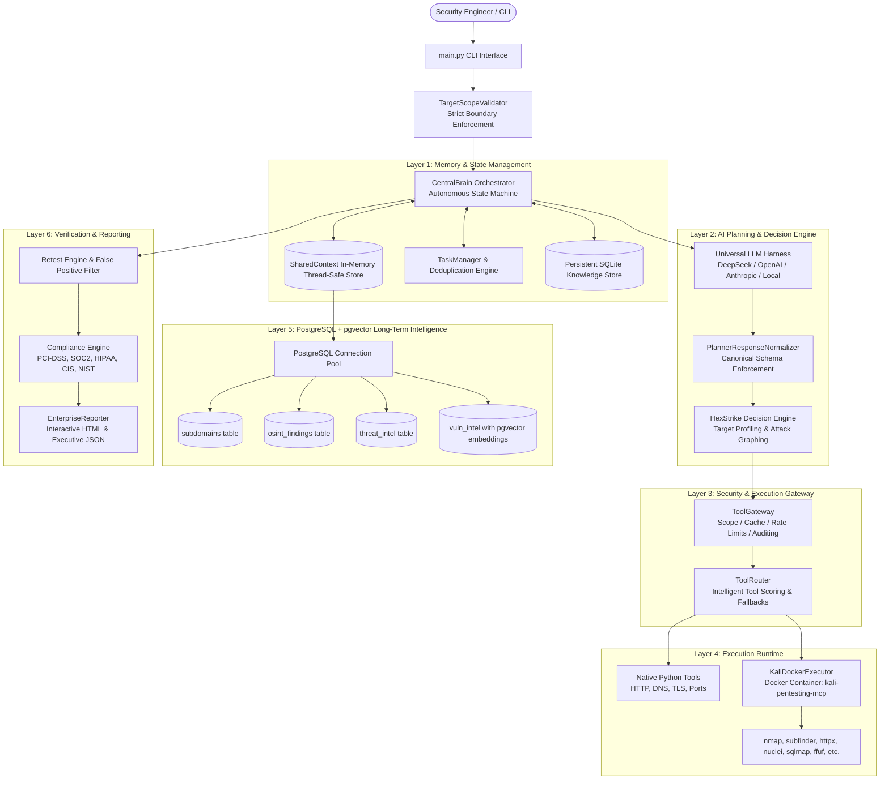

# AntiGravity Platform — Complete Architectural & Design Guide

---

## 1. Executive Summary & Philosophy

The **AntiGravity Autonomous Penetration Testing Platform** is an enterprise-grade security assessment framework. It simulates a professional red team operator by combining:
1. **Autonomous Reasoning & Planning (LLMs)** — Formulating dynamic hypotheses, selecting attack paths, and evaluating output.
2. **Deterministic Quality Gates & Deduplication** — Preventing infinite loops, enforcing legal scopes, and ensuring high-confidence validation.
3. **Isolated Tool Execution (Kali Linux Container)** — Running 35+ security tools safely without polluting or risking the host environment.
4. **Vector-Enhanced Long-Term Memory (PostgreSQL + pgvector)** — Persisting scan history, asset inventories, threat intelligence, and enabling semantic search across CVE databases.

---

## 2. End-to-End System Architecture

---

## 3. Why Each Component Exists & How It Works

### A. CentralBrain (`core/central_brain.py`)
* **Purpose:** Acts as the master orchestrator and central coordinator.
* **Why It Is Needed:** Autonomous penetration tests cannot be static sequential scripts. When a new open port or subdomain is discovered in Phase 1, the system must dynamically re-evaluate the attack surface, formulate targeted attack chains, and transition smoothly through phases.
* **Phases Executed:**
  1. `OSINT & RECONNAISSANCE` — Passive asset discovery, DNS enum, certificate transparency.
  2. `DEEP RECONNAISSANCE` — Active tech fingerprinting, service version detection, WAF analysis.
  3. `VULNERABILITY ASSESSMENT` — Nuclei template execution, misconfiguration analysis, parameter discovery.
  4. `ATTACK CHAIN & EXPLOITATION` — Safe Proof-of-Concept (PoC) validation without destructive actions.
  5. `POST-EXPLOITATION SIMULATION` — Privilege escalation auditing and MITRE ATT&CK mapping.
  6. `VALIDATION & REPORTING` — Confidence scoring, false positive reduction, and compliance report generation.

---

### B. PostgreSQL + `pgvector` Database (`hexstrike_pgvector`)
* **Purpose:** High-performance, relational, and vector database persistence.
* **Why We Use PostgreSQL:**
  1. **Cross-Scan Memory & Delta Reporting:** Allows tracking targets over time (e.g. Day 1 scan vs Day 30 scan), identifying *New Vulnerabilities*, *Remediated Vulnerabilities*, and *Persistent Vulnerabilities*.
  2. **Multi-Service Concurrency:** Provides connection pooling (`asyncpg` / `psycopg2`) that allows OSINT workers, threat intelligence collectors, and active scanners to write findings simultaneously without file locks.
  3. **Structured Schemas:** Houses relational tables for `subdomains`, `osint_findings`, `threat_intel`, and `scan_metrics`.
* **Why `pgvector` is Essential:**
  * Standard text search cannot match natural language vulnerability descriptions with technical CVEs.
  * `pgvector` stores high-dimensional vector embeddings of CVE advisories, vulnerability write-ups, and technology signatures.
  * **Semantic CVE Matching:** When an endpoint returns a technology banner (e.g., `"Apache Struts 2.5.12"`), the system queries `pgvector` using cosine similarity (`<->`) to instantly find the most relevant known exploits and CVEs.

---

### C. Kali Linux Docker Container (`kali-pentesting-mcp`)
* **Purpose:** Isolated, containerized runtime containing 35+ industry-standard security tools.
* **Why It Is Containerized:**
  1. **Zero Host Contamination:** Avoids installing dozens of intrusive tools, wordlists, and native Linux dependencies onto the user's host operating system (especially on Windows).
  2. **Consistent Environment:** Guarantees exact package versions for tools like `nmap`, `subfinder`, `httpx`, `nuclei`, `sqlmap`, `ffuf`, `assetfinder`, `whatweb`, and `wafw00f`.
  3. **Security Isolation:** Security testing tools run inside a sandboxed Linux network bridge with restricted host access.
  4. **Volume Mounting (`/pentesting`):** The project workspace is mounted directly into the container so reports, logs, and artifacts are instantly available on the host.

---

### D. ToolGateway & ToolRouter (`core/tool_gateway.py`, `core/tool_router.py`)
* **Purpose:** Intelligent security proxy and tool selector between AI decisions and binary execution.
* **Why It Is Needed:**
  * **Scope Enforcement:** Intercepts every single tool call and checks with `TargetScopeValidator` before execution. If a tool tries to scan an unauthorized IP or out-of-scope domain, it is immediately blocked and audited.
  * **Tool Scoring (HexStrike AI Engine):** If the planner requests `dns_enumeration`, the router scores available tools (`subfinder`, `amass`, `assetfinder`, `dnsenum`) based on historical speed, accuracy, and target type (e.g., web application vs network host).
  * **Automatic Fallback Recovery:** If `assetfinder` fails or is unavailable, the router automatically fails over to `subfinder` or `amass` without crashing the scan.

---

### E. PlannerResponseNormalizer (`core/normalizer.py`)
* **Purpose:** Canonical schema parser and classifier for LLM outputs.
* **Why It Is Needed:**
  * LLMs frequently output varying JSON structures, markdown wrappers, or inconsistent field names (`tasks` vs `agent_spec`, `run_task` vs `spawn_agents`).
  * The Normalizer strips markdown, validates Pydantic schemas, converts messy LLM text into strictly typed `BrainDecision` objects, and maps objectives to precise `CapabilityType` enums using keyword intelligence.

---

### F. TaskManager & Deduplication Tracker (`core/task_manager.py`)
* **Purpose:** Task lifecycle coordinator and loop prevention engine.
* **Why It Is Needed:**
  * Without task tracking, LLM-based agents get trapped in infinite loops proposing the same scan over and over.
  * The `TaskManager` generates unique fingerprint hashes for every `(capability, target, params)` pair.
  * Tracks statuses: `CREATED` $\rightarrow$ `QUEUED` $\rightarrow$ `RUNNING` $\rightarrow$ `COMPLETED` / `FAILED`.
  * Deduplicates tasks so identical requests are never repeated unnecessarily.

---

### G. SharedContext (`core/shared_context.py`)
* **Purpose:** Centralized, thread-safe in-memory state repository.
* **Why It Is Needed:**
  * Acts as the single source of truth during an active scan.
  * Uses `threading.Lock` so concurrent workers can safely update discovered subdomains, open ports, web endpoints, captured HTTP headers, and detected technologies.

---

### H. Universal LLM Harness (`agents/universal_llm_harness.py`)
* **Purpose:** Unified AI provider abstraction.
* **Why It Is Needed:**
  * Decouples the platform from any single AI vendor.
  * Supports **DeepSeek**, **OpenAI (GPT-4o)**, **Anthropic (Claude 3.5 Sonnet)**, and local air-gapped models via **Ollama**.
  * Tracks token usage, latencies, and API costs in real time.

---

### I. Reporting & Compliance Engine (`core/reporting.py`, `compliance/`)
* **Purpose:** Translates technical scan results into actionable business intelligence.
* **Why It Is Needed:**
  * Raw scanner output is noisy and difficult for stakeholders to understand.
  * Automatically maps every finding to 5 major regulatory frameworks:
    1. **PCI-DSS v4.0** (Payment Card Industry)
    2. **SOC 2 Type II** (Security & Availability)
    3. **HIPAA Security Rule** (Healthcare data protection)
    4. **CIS Controls v8** (Critical Security Controls)
    5. **NIST CSF** (National Institute of Standards and Technology)
  * Generates clean HTML dashboards and executive JSON summaries.

---

## 4. Summary Table of Components

| Component | Technology | Primary Function |
|---|---|---|
| **CentralBrain** | Python Asyncio | Orchestrates all scan phases and controls the autonomous loop |
| **PostgreSQL** | PostgreSQL 16 | Relational storage for scan histories, delta analysis, and OSINT records |
| **pgvector** | C / PostgreSQL Ext | Vector embeddings for semantic search over CVE and exploit databases |
| **Kali Container** | Docker (Kali Linux) | Sandboxed runtime with 35+ security tools (Nmap, Nuclei, Subfinder, etc.) |
| **SharedContext** | Python (Thread-safe) | Single source of truth for in-memory scan state and discovered assets |
| **ToolGateway** | Python | Validates legal scope, enforces rate limits, and audits tool calls |
| **ToolRouter** | HexStrike Scoring Engine | Selects the best tool for each capability and manages automatic fallbacks |
| **Normalizer** | Pydantic V2 | Converts unstructured LLM output into validated canonical task schemas |
| **TaskManager** | Python | Coordinates task lifecycles, states, and fingerprint deduplication |
| **Reporter** | HTML5, CSS3, JSON | Generates executive reports mapped to PCI-DSS, SOC2, HIPAA, CIS, and NIST |
